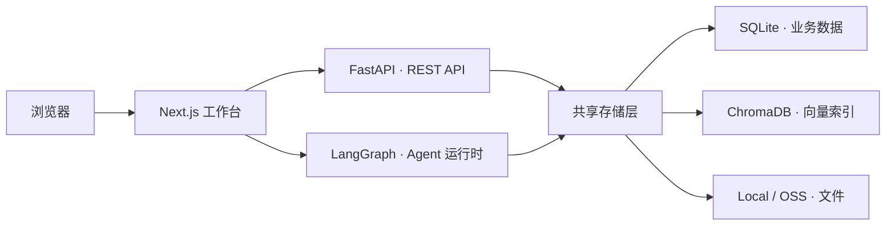

# RumiAI

RumiAI 是一个文档驱动的 AI 工作台。上传资料后，可以在同一工作区完成知识问答、PPT 生成、口播稿编写、语音合成和 PPT 风格提取。

## 产品特点

### 基于资料的知识问答

- 支持 PDF、Word、Markdown 和 PPTX 等常见文档
- 自动解析、分块、建立向量索引，并生成文档摘要
- 回答基于当前工作区资料，可追溯引用来源

### 从内容到演示文稿

- 根据资料和对话直接生成 PPT
- 支持多种内置风格，也可以从已有 PPTX 中提取自定义风格
- 提供在线预览、内容编辑、下载和公开分享

### 口播稿与语音合成

- 基于已生成的 PPT 创建逐页口播稿
- 支持选择音色并合成 TTS 音频
- 提供按页播放以及 PPT、音频同步演示

### 一体化工作区

- 每个工作区独立管理文档、对话、任务和产出物
- 支持本地文件存储或阿里云 OSS
- 管理后台提供用户活跃、内容产出、邀请码和访问模式管理
- 邀请码模式可随时关闭；关闭后访客可直接使用全部功能，并拥有独立的数据空间

## 本地启动与部署

### 环境要求

| 工具 | 版本 |
|------|------|
| Python | >= 3.12 |
| Node.js | >= 22 |

项目脚本会自动检查并安装 `uv`、`pnpm` 等辅助工具。

### 1. 初始化

```bash
git clone https://github.com/huiru-wang/rumi-ai.git
cd rumi-ai
./scripts/init.sh
```

初始化脚本会创建 `backend/.env`、运行时数据目录，并安装前后端依赖。

### 2. 配置 API Key

编辑 `backend/.env`。最少需要配置 LLM 和 Embedding 服务：

```env
OPENAI_API_KEY=your_api_key
OPENAI_API_BASE=https://api.deepseek.com
MAIN_MODEL=deepseek-v4-flash

EMBEDDING_API_KEY=your_dashscope_api_key
EMBEDDING_MODEL=text-embedding-v2
```

常用配置：

| 变量 | 用途 | 要求 |
|------|------|------|
| `OPENAI_API_KEY` | Agent 推理和文档摘要 | 必须 |
| `OPENAI_API_BASE` | OpenAI 兼容接口地址 | 默认 DeepSeek |
| `MAIN_MODEL` | Agent 主模型 | 默认 `deepseek-v4-flash` |
| `EMBEDDING_API_KEY` | 文档向量化 | 必须 |
| `EMBEDDING_API_BASE` | Embedding 接口地址 | 默认 Dashscope |
| `EMBEDDING_MODEL` | Embedding 模型 | 默认 `text-embedding-v2` |
| `TTS_API_KEY` / `TTS_MODEL` | 语音合成 | 可选 |
| `VISION_API_KEY` / `VISION_MODEL` | PPT 风格提取 | 可选 |
| `ADMIN_USERNAME` | 管理后台账号 | 使用管理后台时配置 |
| `ADMIN_PASSWORD` | 管理后台密码 | 使用管理后台时配置 |
| `ADMIN_SESSION_SECRET` | 管理会话签名密钥 | 生产环境使用随机长字符串 |
| `DATA_DIR` | SQLite、Chroma 和文件数据目录 | 默认 `./data` |
| `PUBLIC_API_BASE` | 对外可访问的 FastAPI 地址 | 默认 `http://localhost:8000` |
| `OSS_ACCESS_KEY_ID/SECRET` | 阿里云 OSS 存储 | 可选，默认本地存储 |
| `LANGSMITH_API_KEY` | Agent 链路追踪 | 可选 |
| `INVITE_CODES_FILE` | 旧邀请码 JSON 的启动导入路径 | 仅兼容旧数据，可不配置 |

### 3. 启动

```bash
./scripts/start.sh
```

启动完成后：

- 工作台：[http://localhost:3000](http://localhost:3000)
- 管理后台：[http://localhost:3000/admin](http://localhost:3000/admin)

检查服务状态：

```bash
./scripts/doctor.sh
```

### 日常开发命令

```bash
# 启动、重启和停止开发环境
./scripts/start.sh dev
./scripts/restart.sh dev
./scripts/stop.sh dev

# 后端测试
cd backend && uv run pytest tests/

# 前端检查与构建
cd frontend && pnpm lint && pnpm build
```

### 生产部署

项目内置 `dev` 和 `prod` 两套启动配置。生产环境建议由 Nginx 统一反向代理，并将数据目录设置到持久化磁盘。

```bash
cp backend/.env.production.example backend/.env.production
# 编辑 backend/.env.production，配置 API Key、管理后台账号和 DATA_DIR

./scripts/doctor.sh prod
./scripts/start.sh prod
```

前端公开地址配置位于 `frontend/.env.production.example`：

```env
NEXT_PUBLIC_API_BASE=https://your-domain.example
NEXT_PUBLIC_LANGGRAPH_API_URL=https://your-domain.example/lg
```

生产端口约定：

| 服务 | 端口 | 建议暴露方式 |
|------|-----:|--------------|
| Next.js | 3000 | Nginx `/` |
| FastAPI | 8000 | Nginx `/api/` |
| LangGraph | 2024 | Nginx `/lg/` |
| ChromaDB | 8001 | 仅本机访问 |

## 技术架构

RumiAI 使用前后端分离的双进程后端架构：FastAPI 处理业务 API，LangGraph 负责 Agent 推理和流式对话。两个进程共享同一套存储。



| 层 | 主要技术 | 职责 |
|----|----------|------|
| 前端 | Next.js 16、React 19、Tailwind CSS 4 | 工作区、对话、文档、任务、播放和管理后台 |
| REST API | FastAPI、aiosqlite | 工作区、文档、任务、分享、邀请码和运营数据 |
| Agent | LangGraph、LangChain | 流式对话、工具调用、RAG、PPT 和口播稿生成 |
| 存储 | SQLite、ChromaDB、Local/OSS | 元数据、消息、向量索引和产出文件 |
| AI 服务 | OpenAI 兼容 LLM、Dashscope | 推理、Embedding、TTS 和视觉理解 |

核心目录：

```text
rumi-ai/
├── backend/
│   ├── src/api/          # FastAPI 路由与依赖
│   ├── src/agent/        # LangGraph Agent
│   ├── src/managers/     # 文档、TTS、风格等业务管理器
│   ├── src/storage/      # SQLite、ChromaDB、文件存储
│   ├── src/tools/        # Agent 工具
│   ├── skills/           # PPT、口播稿等 Agent 技能
│   └── tests/
├── frontend/src/        # Next.js 页面、组件和 API 客户端
├── scripts/             # 初始化、启动、停止和健康检查
└── docs/                # 详细架构文档
```

更多设计细节：

- [后端架构](docs/backend-architecture.md)
- [前端架构](docs/frontend-architecture.md)
- [文档解析架构](docs/document-parsing-architecture.md)
- [PPT 风格提取架构](docs/style-extraction-architecture.md)
- [开发与协作规范](AGENTS.md)
