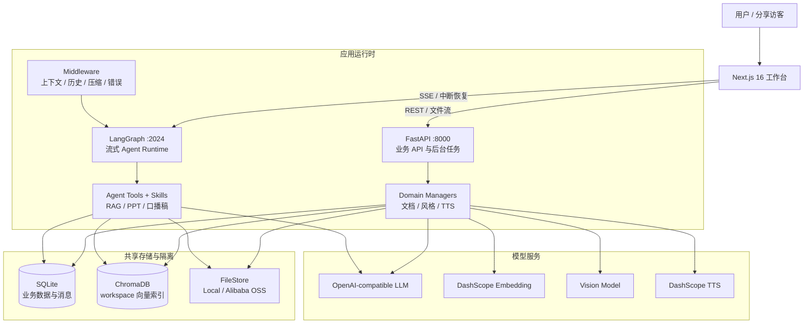
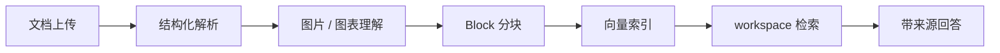
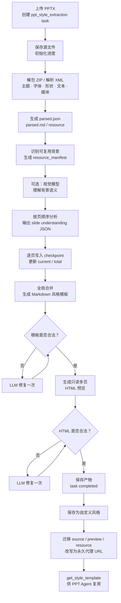
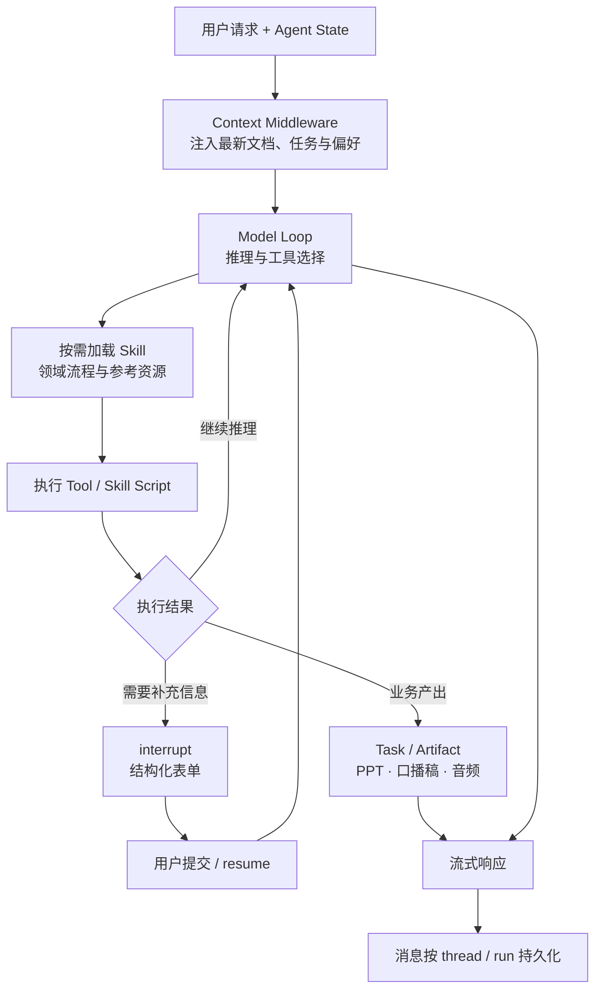

# RumiAI

RumiAI 是一个基于 Python、FastAPI、LangGraph 和 Next.js 构建的文档驱动型 Agent 内容工作台：

- Agent Harness：以 LangGraph 为基础构建领域级 Agent Harness，扩展 Agent State、Middleware、Tools、Skills 和 Human-in-the-loop，实现动态上下文注入、工具调用、长对话管理及人机协作。

- 分层存储：基于 SQLite、ChromaDB 和 Local/OSS，分别管理业务数据、工作区向量知识库及文件产物，并实现用户与工作区级数据隔离。

- 文档解析与可溯源 RAG：支持 PDF、Word、Markdown 等多种格式文档的结构化解析、分块和向量化，提供带文档、章节及页码引用的知识问答。

- PPT 生成与在线编辑：提供多种内置 PPT 风格，可基于文档和对话生成演示文稿，并支持在线预览、实时编辑、下载、播放及公开分享。

- AI 演示与语音合成：基于已生成的 PPT 自动编写逐页口播稿，支持多种音色的 TTS 合成，并以 PPT 与音频逐页同步的类视频形式播放。

- 自定义 PPT 风格提取：智能解析和理解用户上传的 PPTX 文件，提取版式、配色、字体及背景资源，生成可复用的自定义风格模板，用于持续生成视觉风格一致的 PPT。

[在线体验](https://rumi.robinverse.me) · [后端架构](docs/backend-architecture.md) · [前端架构](docs/frontend-architecture.md) · [PPT 风格提取](docs/style-extraction-architecture.md)

## 产品演示

<!-- TODO: 在此补充 20～30 秒产品 GIF。建议完整展示：上传资料 → 基于资料提问 → 生成 PPT → 生成口播稿并播放。 -->

> 演示 GIF 待补充。

典型工作流：

1. 创建工作区并上传业务资料。
2. 系统异步完成解析、图片/图表理解、向量索引和摘要生成。
3. 用户基于资料问答，回答附带文档、章节和页码引用。
4. Agent 加载 PPT Skill 和指定风格，生成可在线编辑的 HTML 演示文稿。
5. 基于 PPT 生成逐页口播稿和 TTS 音频，在线同步播放或通过链接分享。

## 整体架构



为什么拆成双进程：

- **FastAPI** 承载边界明确、需要稳定事务语义的 REST 业务和异步任务。
- **LangGraph** 专注长连接流式输出、Agent state、工具调用和 interrupt/resume。
- 两个进程共享持久层但独立初始化依赖，互相故障隔离，也便于后续分别扩缩容。

## 核心链路

### 文档解析与 RAG



- 统一 `ParsedDocument → DocumentBlock → ChunkWithMetadata` 数据模型，保留章节、页码、BBox、资源路径和内容类型。
- 每个工作区使用独立 Chroma collection；文件通过 task/document/share 级代理访问，不向前端暴露本地路径或 OSS key。
- 解析采用可观测状态机：`uploaded → parsing → parsed → chunking → indexing → summarizing → ready | error`。
- 图片理解失败时降级为文本链路，不让单个非核心能力拖垮整份文档。

### PPTX 风格提取完整链路



链路中的关键工程取舍：

- 逐页分析采用顺序执行，上一页类型可作为下一页上下文；每页完成即持久化 checkpoint，单页失败生成 fallback 后继续。
- 鉴权、限流、额度、连接等系统性错误会立即终止并保留现场，避免批量生成无意义 fallback。
- 只迁移明确可复用的背景资源；保存风格时统一改写资源 URL，避免任务临时目录和用户长期资产耦合。
- 风格提取是确定性后台工作流，不混入主对话 Agent graph，降低调试和恢复成本。

## Agent Harness 运行机制



LangGraph 提供基础 Agent Loop、thread、stream 和 interrupt 协议；项目在其上实现面向业务的 Harness 层：

- `ContextInjectMiddleware` 每轮读取数据库中的最新文档和任务，避免过期对话历史覆盖真实业务状态。
- `SummarizationMiddleware` 在上下文达到阈值时压缩旧消息，并保留最近对话；摘要消息不会作为普通内容流式展示或写入业务历史。
- `ModelMessageSanitizerMiddleware` 修复不完整 Tool Call 等模型消息，避免不同模型协议差异破坏后续请求。
- `MessageHistoryMiddleware` 在用户消息、模型响应、工具返回和 Run 结束等阶段持久化消息，支持历史分页与会话恢复。
- `load_skill` 渐进加载 Skill 主说明和引用文件；`run_skill_script` 限制脚本目录、解释器、超时和输出长度。
- `clarify_form` 将缺失参数建模为运行时中断；`save_ppt`、`save_narration` 等工具把输出转成持久化 Artifact。

## 工程设计

| 设计点 | 实现 |
|---|---|
| 多租户隔离 | workspace/user 元数据隔离；向量 collection 按 workspace 划分；文件路径按 user/workspace 组织 |
| 异步任务 | 文档解析与风格提取由 FastAPI BackgroundTasks 执行，任务表持久化阶段、进度、warning 和结果 |
| 存储抽象 | `FileStore → LocalProvider / OSSProvider`，业务层不感知具体存储实现 |
| 安全文件访问 | 仅暴露 task/share/document/style 级资源端点，禁用任意 path-based 文件读取 |
| 失败降级 | Vision、单页风格理解、摘要等非关键阶段提供 fallback；业务错误统一为安全错误码与文案 |
| 产出物模型 | PPT、口播稿、风格提取统一建模为 task，支持父子任务、预览、下载、分享与清理 |
| 可运维性 | dev/prod 启停脚本、Nginx SSE 配置、结构化进度、日志上下文与可选 LangSmith tracing |

## 技术栈

| 层 | 技术 |
|---|---|
| Frontend | Next.js 16、React 19、TypeScript、Tailwind CSS 4、`@langchain/react` |
| API / Agent | Python 3.12、FastAPI、LangChain、LangGraph、Pydantic |
| Data | SQLite + aiosqlite、ChromaDB HTTP Server、Local FS / Alibaba Cloud OSS |
| AI | OpenAI-compatible LLM、DashScope Embedding / TTS、可配置 Vision Model |
| Tooling | uv、pnpm、pytest、ESLint、Nginx |

## 快速开始

### 环境要求

- Python >= 3.12
- Node.js >= 22
- Linux / macOS（启动脚本依赖 Bash；建议安装 `lsof`）

### 1. 初始化

```bash
git clone https://github.com/huiru-wang/rumi-ai.git
cd rumi-ai
./scripts/init.sh
```

初始化脚本会安装后端与前端依赖、创建 `backend/.env`，并准备本地数据目录。

### 2. 配置模型服务

编辑 `backend/.env`，最少配置 Agent LLM、摘要/风格模型和 Embedding（两类文本模型可以复用同一服务）：

```env
OPENAI_API_KEY=your_api_key
OPENAI_API_BASE=https://api.deepseek.com
MAIN_MODEL=your_model

SUMMARIZATION_API_KEY=your_api_key
SUMMARIZATION_API_BASE=https://api.deepseek.com
SUMMARIZATION_MODEL=your_model

EMBEDDING_API_KEY=your_dashscope_api_key
EMBEDDING_API_BASE=https://dashscope.aliyuncs.com/compatible-mode/v1
EMBEDDING_MODEL=text-embedding-v2
```

可选能力：

| 配置 | 能力 |
|---|---|
| `VISION_*` | 文档图片/图表与 PPT 背景理解 |
| `TTS_*` | 逐页口播音频合成 |
| `OSS_ENABLE` + `OSS_*` | 将文件存储从本地切换到阿里云 OSS |
| `LANGSMITH_*` | Agent 链路追踪 |

完整字段见 [`backend/.env.example`](backend/.env.example)。

### 3. 启动

```bash
./scripts/start.sh dev
```

| 服务 | 地址 |
|---|---|
| 工作台 | http://localhost:3000 |
| 管理后台 | http://localhost:3000/admin |
| FastAPI | http://localhost:8000 |
| LangGraph | http://localhost:2024 |
| ChromaDB | http://localhost:8001（仅建议内网访问） |

```bash
# 停止 / 重启
./scripts/stop.sh dev
./scripts/restart.sh dev

# 后端测试
cd backend && uv run pytest tests/

# 前端检查与构建
cd frontend && pnpm lint && pnpm build
```

## 项目结构

```text
rumi-ai/
├── backend/
│   ├── src/api/          # FastAPI 路由与依赖初始化
│   ├── src/agent/        # LangGraph Agent state 与 graph
│   ├── src/managers/     # 文档、风格、TTS 等业务编排
│   ├── src/middlewares/  # Agent 横切能力
│   ├── src/parsers/      # PDF、DOCX、Markdown、PPTX 解析
│   ├── src/storage/      # SQLite、ChromaDB、FileStore
│   ├── src/tools/        # Agent tools
│   ├── skills/           # PPT、口播稿 Skills
│   └── tests/
├── frontend/src/         # Next.js 页面、工作区组件与 API client
├── docs/                 # 架构与关键链路文档
├── scripts/              # 初始化、启停与环境配置
└── deploy/               # Nginx 部署配置
```

## 设计文档

- [后端架构](docs/backend-architecture.md)
- [前端架构](docs/frontend-architecture.md)
- [文档解析架构](docs/document-parsing-architecture.md)
- [PPTX 风格提取架构](docs/style-extraction-architecture.md)
- [错误处理规范](docs/error-handling.md)
- [开发与协作约定](AGENTS.md)

## 当前边界

- 当前访问控制用于产品体验与邀请管理，不等同于完整的企业级认证、RBAC 与审计体系。
- 文档解析暂未提供扫描 PDF OCR 专用链路；图片内容依赖可选 Vision Model 补全。
- `BackgroundTasks` 适合当前单机版本；多实例部署时应迁移到独立任务队列，并为长任务增加租约、幂等与重试机制。
- SQLite 满足当前规模下的低运维成本；横向扩展时可迁移到 PostgreSQL，并分别扩容 API、Agent Runtime 和 Worker。

## License

本项目暂未声明开源许可证。代码可供阅读与交流；如需复用或二次发布，请先联系项目作者。
