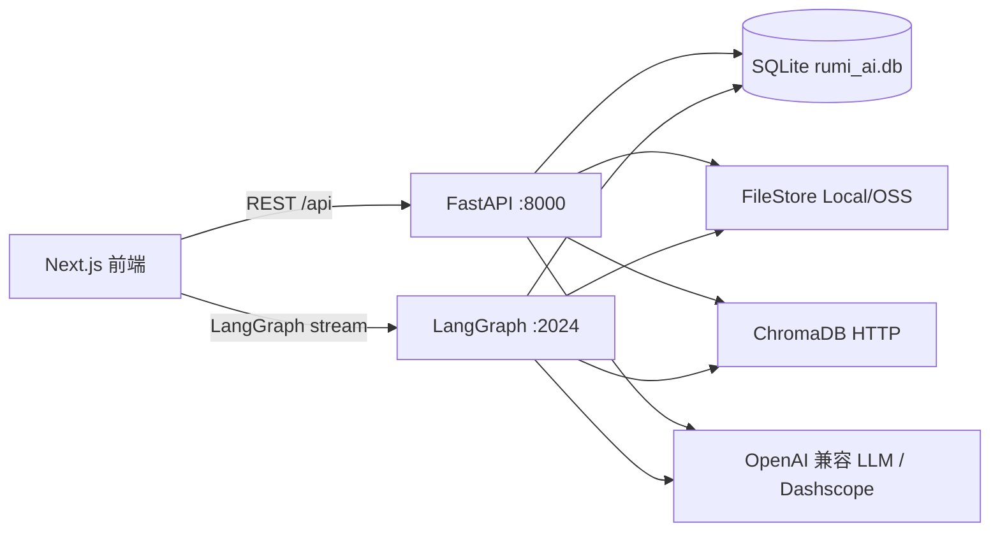

# RumiAI 后端架构

本文档描述当前代码实现，面向后续维护和 AI 协作。后端目标是保持简单、稳定、可回溯：REST API 负责业务 CRUD 和异步任务，LangGraph 负责对话推理和工具调用，存储层统一隔离工作区与用户文件。

## 1. 总览

本地开发由 4 个服务组成：

| 服务 | 端口 | 入口 | 职责 |
|------|-----:|------|------|
| FastAPI | 8000 | `backend/src/api/routes.py` | 工作区、文档、任务、消息、PPT 风格、分享、文件代理 |
| LangGraph Server | 2024 | `backend/src/agent/graph.py` | 主 Agent 流式对话、工具调用、中断恢复 |
| ChromaDB HTTP Server | 8001 | 启动脚本管理 | 向量索引，collection 按 workspace 隔离 |
| Next.js | 3000 | `frontend/` | 工作台 UI |

后端是双进程架构：



两个进程共享 SQLite、ChromaDB 和 FileStore，但各自独立初始化依赖实例。FastAPI 从 `src/api/deps.py` 创建依赖，LangGraph 从 `src/agent/graph.py._make_default_graph()` 创建依赖。

## 2. 关键目录

| 路径 | 职责 |
|------|------|
| `backend/src/api/routes.py` | 所有 REST API、业务错误包装、文件代理和分享端点 |
| `backend/src/api/deps.py` | FastAPI 进程依赖初始化 |
| `backend/src/app_context.py` | `AppContext`，统一创建 DB、VectorStore、FileStore、SkillManager |
| `backend/src/agent/graph.py` | 主 Agent 图，注册模型、工具和中间件 |
| `backend/src/agent/state.py` | Agent 运行态字段：`workspace_id`、`ppt_style`、`voice_id`、`current_ppt_task_id` |
| `backend/src/agent/message_history.py` | LangGraph 消息持久化与历史恢复 |
| `backend/src/middlewares/` | Agent 中间件链 |
| `backend/src/tools/` | Agent 工具 |
| `backend/src/managers/` | 文档、TTS、Prompt、技能、风格提取、视觉理解等业务编排 |
| `backend/src/parsers/` | PDF、DOCX、Markdown/TXT、PPTX 解析 |
| `backend/src/storage/` | SQLite、ChromaDB、FileStore、Local/OSS provider、seed 数据 |
| `backend/skills/` | Agent 可加载技能，当前为 `ppt` 和 `narration` |

## 3. 依赖入口

`AppContext.from_env()` 是共享依赖入口：

```python
@dataclass
class AppContext:
    db: Database
    vector_store: VectorStore
    file_store: FileStore
    skill_manager: SkillManager
```

环境变量重点：

| 变量 | 用途 |
|------|------|
| `DATA_DIR` | SQLite 与本地文件根目录，默认 `./data` |
| `CHROMA_HOST` / `CHROMA_PORT` | ChromaDB HTTP 服务地址 |
| `OPENAI_API_KEY` / `OPENAI_API_BASE` / `MAIN_MODEL` | 主 Agent 模型 |
| `SUMMARIZATION_API_KEY` / `SUMMARIZATION_API_BASE` / `SUMMARIZATION_MODEL` | 文档摘要、对话摘要、风格生成文本模型 |
| `EMBEDDING_API_KEY` / `EMBEDDING_MODEL` | Dashscope Embedding |
| `TTS_API_KEY` / `TTS_MODEL` | 口播稿音频生成 |
| `VISION_API_KEY` / `VISION_MODEL` | 文档图片理解和 PPTX 背景图分析 |
| `OSS_ENABLE` 和 OSS 相关变量 | 切换 LocalProvider / OSSProvider |
| `PUBLIC_API_BASE` | 生成可公开访问的代理 URL，用于风格资源和分享资源 |

## 4. 数据模型

SQLite 由 `backend/src/storage/database.py` 管理，启动时自动建表并做轻量迁移。

| 表 | 关键字段 | 说明 |
|----|----------|------|
| `workspace` | `id`, `user_id`, `name`, `thread_id`, `ext_data` | `ext_data` 保存 `ppt_style` 和 `voice_info` |
| `document` | `workspace_id`, `filename`, `file_type`, `summary`, `storage_path`, `status`, `progress_data`, `content_hash` | 文档源文件、解析进度和摘要 |
| `task` | `workspace_id`, `type`, `title`, `status`, `result_data`, `parent_task_id` | PPT、口播稿、风格提取任务；口播稿挂在 PPT 子任务下 |
| `message` | `thread_id`, `workspace_id`, `run_id`, `message_id`, `role`, `content`, `tool_calls` | Agent 消息历史，支持按 turn/run 分页 |
| `ppt_style` | `user_id`, `category`, `name`, `name_en`, `description`, `style_description`, `resource_manifest`, `preview_path` | 系统风格和用户自定义风格 |
| `share_link` | `token`, `task_id`, `workspace_id`, `type`, `revoked_at` | PPT/口播稿公开分享链接 |

系统 PPT 风格来自 `backend/src/storage/seed_data/ppt_styles/`，DB 初始化时会重置并重新 seed `user_id = 'system'` 的记录。

## 5. 文件存储

`FileStore` 是文件访问的唯一业务入口，底层委托给 `LocalProvider` 或 `OSSProvider`。新路径结构：

```text
user/{user_id}/workspace/{workspace_id}/docs/{filename}
user/{user_id}/workspace/{workspace_id}/ppt/{task_id}/{filename}
user/{user_id}/workspace/{workspace_id}/style/{task_id}/{filename}
user/{user_id}/style/{style_id}/{filename}
```

开发注意：

- 不要在前端暴露 `storage_path`、OSS key 或本地绝对路径。
- `/api/files/{path}` 和 `/api/file-view/{path}` 当前返回 410，路径直出已经禁用。
- 预览和下载必须走 task/share/document/style 级端点，例如 `/api/tasks/{task_id}/preview`、`/api/tasks/{task_id}/audio/{slide_number}`、`/api/documents/{doc_id}/asset/{filename}`。
- FileStore 保留 legacy absolute path smart routing，用于兼容旧 DB 记录，不应作为新代码设计依赖。

## 6. REST API

FastAPI 的业务接口统一返回：

```json
{"data": ..., "code": 0, "message": "ok"}
```

业务错误使用 `BizException`，HTTP 仍返回 200；公开分享和文件代理中的不可用资源使用常规 HTTP 4xx。

主要接口：

| 方法 | 路径 | 说明 |
|------|------|------|
| `POST` | `/api/workspaces` | 创建工作区，包含用户配额和同名检测 |
| `GET` | `/api/workspaces` | 按 `user_id` 列工作区 |
| `GET` | `/api/workspaces/{id}` | 获取工作区和配置 |
| `PATCH` | `/api/workspaces/{id}/thread` | 保存 LangGraph thread_id |
| `PATCH` | `/api/workspaces/{id}/config` | 更新 `ext_data` 配置 |
| `DELETE` | `/api/workspaces/{id}` | 删除工作区、文档、向量和文件 |
| `GET` | `/api/threads/{thread_id}/messages` | 按 turn 分页加载消息 |
| `GET` | `/api/threads/{thread_id}/history-runs` | 按 LangGraph run 分页加载历史 |
| `GET` | `/api/threads/{thread_id}/messages/{message_id}` | 获取单条消息 |
| `POST` | `/api/workspaces/{id}/documents` | 上传文档并启动后台解析 |
| `GET` | `/api/workspaces/{id}/documents` | 文档列表和进度 |
| `DELETE` | `/api/workspaces/{id}/documents/{doc_id}` | 删除文档和向量 |
| `GET` | `/api/workspaces/{id}/tasks` | 任务列表，顶层任务带 `children` |
| `GET` | `/api/workspaces/{id}/tasks/{task_id}` | 单任务详情 |
| `DELETE` | `/api/workspaces/{id}/tasks/{task_id}` | 删除任务、子任务、分享和文件 |
| `PUT` | `/api/workspaces/{id}/tasks/{task_id}/file` | 回写 PPT HTML |
| `POST` | `/api/workspaces/{id}/style-extraction` | 上传 PPTX 并启动风格提取 |
| `DELETE` | `/api/workspaces/{id}/style-extraction/{task_id}` | 取消并删除风格提取任务 |
| `POST` | `/api/style-extraction/{task_id}/save` | 保存为用户自定义 PPT 风格 |
| `GET` | `/api/ppt-styles` | 系统 + 用户 PPT 风格 |
| `DELETE` | `/api/ppt-styles/{style_id}` | 删除用户自定义风格 |
| `GET` | `/api/ppt-styles/{style_id}/preview` | 风格预览 HTML |
| `GET` | `/api/voices` | 内置 TTS 音色 |
| `GET/POST/DELETE` | `/api/tasks/{task_id}/share` | 查询、创建、撤销分享 |
| `GET` | `/api/shares/{token}` | 公开分享元数据 |
| `GET` | `/api/shares/{token}/ppt` | 公开 PPT HTML |
| `GET` | `/api/shares/{token}/audio/{slide_number}` | 公开口播音频 |
| `GET` | `/api/tasks/{task_id}/preview` | PPT 预览，可 `thumb=1` |
| `GET` | `/api/tasks/{task_id}/download` | PPT 下载 |
| `GET` | `/api/tasks/{task_id}/audio/{slide_number}` | 口播音频预览 |
| `GET` | `/api/tasks/{task_id}/narration-text` | 口播稿 Markdown 预览 |
| `GET` | `/api/tasks/{task_id}/style-preview` | 风格提取任务预览 |
| `GET` | `/api/tasks/{task_id}/style-resource/{filename}` | 风格提取资源代理 |
| `GET` | `/api/documents/{doc_id}/asset/{filename}` | 文档解析图片资源代理 |

## 7. Agent 运行时

主图只有一个 LangGraph graph：

```json
{
  "graphs": {
    "main_agent": "src.agent.graph:graph"
  }
}
```

`create_graph(ctx)` 使用 `langchain.agents.create_agent()` 创建 ReAct Agent。模型是 `ChatOpenAI`，通过 OpenAI 兼容接口调用 `MAIN_MODEL`，开启 streaming 和 `enable_thinking`。

Agent state：

| 字段 | 来源 | 用途 |
|------|------|------|
| `workspace_id` | 前端 ChatPanel 注入 | RAG、任务保存、上下文注入 |
| `ppt_style` | 工作区配置 | PPT 生成风格 |
| `voice_id` | 工作区配置 | TTS 音色 |
| `current_ppt_task_id` | 外部命令 `/narrate` 注入 | 为指定 PPT 生成口播稿 |

中间件注册顺序在 `backend/src/middlewares/__init__.py`：

1. `AgentErrorMiddleware`
2. `ContextInjectMiddleware`
3. `MessageHistoryMiddleware`
4. `ModelMessageSanitizerMiddleware`
5. `SummarizationMiddleware`
6. `LoggingMiddleware`

工具注册在 `backend/src/tools/__init__.py`，当前 8 个：

| 工具 | 说明 |
|------|------|
| `clarify_form` | Agent 中断，向前端表单收集结构化输入 |
| `rag_search` | 按 workspace 检索 ChromaDB |
| `load_skill` | 加载 `backend/skills` 中的技能说明和参考文件 |
| `save_ppt` | 保存 PPT HTML，创建 `ppt` task |
| `run_skill_script` | 执行技能目录内脚本 |
| `get_ppt_detail` | 获取已有 PPT task 详情 |
| `get_style_template` | 获取当前 PPT 风格完整模板 |
| `save_narration` | 保存口播稿并调用 TTS，创建 `narration` task |

## 8. 文档处理

文档上传立即创建 `document` 记录并返回 `uploaded`，实际处理由 FastAPI `BackgroundTasks` 调用 `DocManager.process_document()`。

状态流：

```text
uploaded -> parsing -> parsed -> chunking -> indexing -> summarizing -> ready
                                      \-> error
```

解析细节见 `docs/document-parsing-architecture.md`。

## 9. 风格提取

PPTX 风格提取由 FastAPI 后台任务执行，不经过主对话 Agent 工具链。核心类是 `StyleExtractManager`，入口是 `/api/workspaces/{workspace_id}/style-extraction`。其中资产盘点、布局盘点、风格模板生成/校验/修复、预览 HTML 生成/校验/修复封装在 `backend/src/agent/style_extract_graph.py` 的独立 LangGraph pipeline 中，暂不作为 `langgraph.json` 服务图暴露。

状态流：

```text
generating(parsing -> analyzing_style -> generating_preview) -> completed
                                                             \-> failed/cancelled
```

完整设计见 `docs/style-extraction-architecture.md`。

## 10. 开发规则

- 新 REST 端点放在 `backend/src/api/routes.py`，并通过 `_sanitize_*` 避免泄漏内部路径。
- 新业务编排优先放在 `backend/src/managers/`，数据库操作集中在 `Database`。
- 新 Agent 能力优先做 tool，不要绕过 `create_tools(ctx)`。
- 文档、任务、风格文件都通过 FileStore 保存，不直接操作 OSS key 或本地路径。
- 修改文档解析、风格提取、TTS 这类异步流程时，必须考虑任务状态、进度字段、失败 fallback 和文件清理。
- 不要修改 `langgraph.json`，除非确实新增 graph 或改变 graph 入口。
