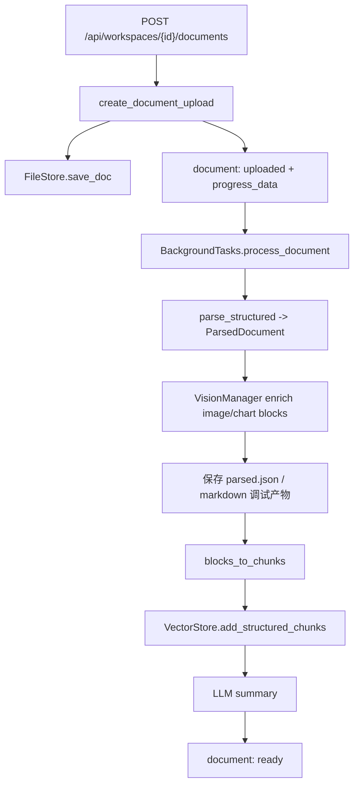
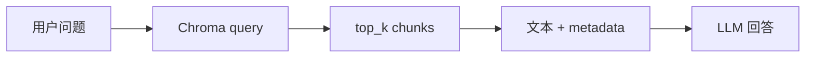

# 文档解析架构

本文档描述当前文档上传与解析实现。解析目标是把用户上传的 PDF、DOCX、Markdown/TXT 转成可检索的结构化 chunks，并生成文档摘要。当前不做 OCR 扫描 PDF 路由，扫描或纯图片 PDF 可能进入 error 或只能索引抽取到的图片摘要。

## 1. 总览

入口是 `backend/src/managers/doc_manager.py` 的 `DocManager`。FastAPI 上传接口先创建 document 记录并保存源文件，再用后台任务执行解析。



状态流：

```text
uploaded -> parsing -> parsed -> chunking -> indexing -> summarizing -> ready
                                      \-> error
```

## 2. 关键文件

| 文件 | 职责 |
|------|------|
| `backend/src/managers/doc_manager.py` | 文档上传、去重、进度、解析编排、分块、入库、摘要 |
| `backend/src/managers/vision_manager.py` | 对 image/chart block 生成 RAG 向短摘要 |
| `backend/src/parsers/base.py` | 统一数据结构：`DocumentBlock`、`ParsedDocument`、`ChunkWithMetadata` |
| `backend/src/parsers/pdf_parser.py` | PDF 文本 block 与嵌入图片抽取 |
| `backend/src/parsers/docx_parser.py` | DOCX 段落、标题、表格、图片抽取 |
| `backend/src/parsers/markdown_parser.py` | Markdown/TXT 章节解析 |
| `backend/src/storage/vector_store.py` | ChromaDB HTTP 写入和检索 |
| `backend/src/api/routes.py` | 文档上传、列表、删除、文档资产代理 |

## 3. 上传与去重

`create_document_upload()` 执行：

1. 根据文件扩展名检测类型：`.pdf`、`.docx/.doc`、`.md`、`.txt`，未知类型按文本兜底。
2. 计算 `sha256` 内容哈希。
3. 调用 `db.find_duplicate_document()`，按文件名或内容哈希拒绝重复上传。
4. 源文件保存到 `user/{user_id}/workspace/{workspace_id}/docs/{filename}`。
5. 创建 `document` 记录，状态为 `uploaded`。
6. PDF 会预估页数和耗时，写入 `progress_data`。

上传接口返回的 document 会被 `_sanitize_document()` 清理，不暴露 `storage_path` 和 `content_hash`。

## 4. 统一结构

解析器输出统一的 `ParsedDocument`：

```python
@dataclass
class ParsedDocument:
    title: str
    blocks: list[DocumentBlock]
    assets: list[DocumentAsset] = field(default_factory=list)
```

核心 block：

```python
@dataclass
class DocumentBlock:
    id: str
    type: str          # title, paragraph, list, table, image, chart
    text: str = ""
    level: int = 0
    page_start: int = 0
    page_end: int = 0
    bbox: list[float] | None = None
    parent_title: str = ""
    caption: str = ""
    asset_path: str = ""
    html: str = ""
    summary: str = ""
    order: int = 0
```

`DocumentBlock.index_text()` 决定最终入向量库的文本。图片和图表会包含“图片：”“所属章节”“图片说明”等文本化信息；表格会包含表格说明和表格文本。

## 5. 解析器

### PDF

`PdfParser.parse_blocks()` 使用 PyMuPDF：

- `get_text("dict")` 读取文本 span、字号、粗体、bbox、页码。
- 根据正文字号和标题启发式判断 `title` / `paragraph`。
- `get_images(full=True)` 抽取嵌入图片，通过 `asset_saver` 保存到文档 assets 子目录。
- 目前表格检测只记录日志，未把 `find_tables()` 结果转成 table block。
- 每页解析会通过 callback 更新 `parsing` 阶段进度。

PDF 标题判断是启发式：

- 字号大于正文字号比例。
- 或粗体且匹配编号/中文章节模式。
- 过长文本不会被判为标题。

### DOCX

`DocxParser.parse_blocks()` 负责保持文档顺序抽取段落、标题、表格和图片。图片通过 `asset_saver` 保存，表格转成可索引文本或 HTML 信息。

### Markdown/TXT

Markdown/TXT 先用 `MarkdownParser.parse()` 转成 legacy `DocumentSection`，再由 `DocManager._sections_to_parsed()` 转成 `ParsedDocument` blocks。

## 6. 图片理解

`DocManager._enrich_blocks()` 遍历 block：

- `image` / `chart`：调用 `VisionManager.enrich_block()`。
- `table`：如果没有 summary，则用行数生成 fallback summary。

`VisionManager` 只有在 `VISION_MODEL`、`VISION_API_KEY` 和 `file_store` 都可用时启用。它会：

1. 从 FileStore 读取图片 bytes。
2. 跳过超过 `VISION_MAX_IMAGE_BYTES` 的图片。
3. 将图片 base64 data URL 发给视觉模型。
4. 要求输出 150 字以内中文摘要。
5. 写回 `block.summary`。

视觉理解失败不会让整个文档解析失败，只记录 warning 并保留原 block。

## 7. 中间产物

解析后会保存两类产物：

| 位置 | 内容 | 用途 |
|------|------|------|
| FileStore docs 目录 | `{stem}.parsed.json` | 当前文档结构化结果，跟随用户文件存储 |
| FileStore docs 目录 | `{stem}.md` | 非 Markdown 源文件的结构化 Markdown 导出 |
| repo `tmp/doc_parse/{doc_id}/` | `{stem}.parsed.json` 和 `{stem}.md` | dev/local/test 环境调试产物 |

生产环境不会写 repo `tmp/doc_parse` 调试产物，除非 `APP_ENV` 属于 `dev/local/development/test`。

## 8. 分块与入库

`blocks_to_chunks(parsed)` 把 block-first 输出转换为 `ChunkWithMetadata`：

```python
@dataclass
class ChunkWithMetadata:
    text: str
    section_title: str = ""
    chapter_title: str = ""
    page_start: int = 0
    page_end: int = 0
    section_level: int = 0
    chunk_index: int = 0
    block_id: str = ""
    block_type: str = ""
    asset_path: str = ""
    caption: str = ""
    bbox: list[float] | None = None
    content_kind: str = "text"
```

分块规则：

- `title` block 只更新当前章节上下文，不直接入库。
- 其他 block 使用 `block.index_text()`。
- 超过 `MAX_CHUNK_SIZE = 2000` 的 block 用 `RecursiveCharacterTextSplitter` 切分，overlap 为 200。
- metadata 保留 doc、filename、章节、页码、block id/type、asset path、caption、bbox、content kind。

向量库：

- 使用 ChromaDB HTTP Server。
- 每个 workspace 一个 collection：`ws_{workspace_id}`。
- embedding 函数是 Dashscope `text-embedding-v2`，由 Chroma collection 调用。
- 写入方法是 `VectorStore.add_structured_chunks()`。

## 9. 摘要生成

`DocManager._generate_summary()`：

- 拼接所有可索引 block 文本。
- 截断到前 8000 字符传给 `SUMMARIZATION_MODEL`。
- 要求输出 200 字以内中文摘要。
- LLM 失败时 fallback 为前 500 字符。

摘要写入 `document.summary`，并把状态更新为 `ready`。

## 10. 删除与清理

删除单文档：

1. 删除源文件。
2. 尝试删除解析 Markdown。
3. 从 ChromaDB 删除该 `doc_id` 的 chunks。
4. 删除 document 记录。

删除工作区：

1. 遍历删除所有文档和向量。
2. 删除 workspace collection。
3. 调用 `FileStore.delete_workspace_async()` 删除本地或 OSS 下的工作区文件。

## 11. RAG 检索

Agent 工具 `rag_search` 调用 `VectorStore.search()`：



检索结果包含：

- `text`
- `doc_id`
- `filename`
- `section_title`
- `chapter_title`
- `page_start/page_end`
- `block_id/block_type`
- `asset_path`
- `caption`
- `content_kind`
- `distance`

当前 RAG 上下文仍以文本为主，图片内容依赖解析阶段生成的 summary 进入 embedding。

## 12. 开发注意

- 不要绕过 `DocManager` 直接写 document 状态。
- 新解析器应输出 `ParsedDocument`，不要新增平行数据结构。
- 图片资源必须通过 `asset_saver` 进入 FileStore，不要把临时路径写入 block。
- 解析失败要写入 `status=error` 和 `error_message`，前端依赖这个状态展示。
- 若新增可前端访问的文档资源，使用 `/api/documents/{doc_id}/asset/{filename}` 这类安全代理，不暴露 FileStore key。
