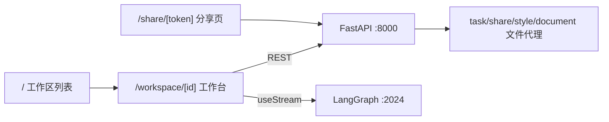
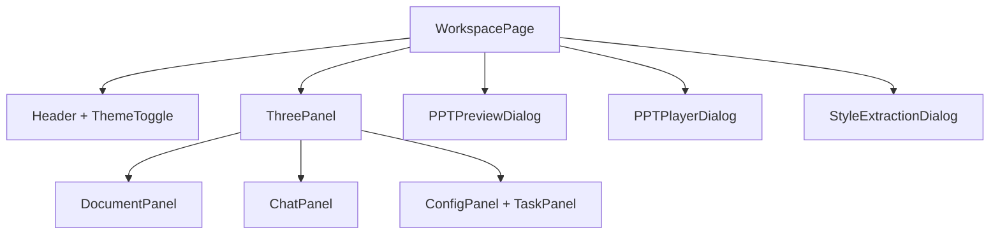
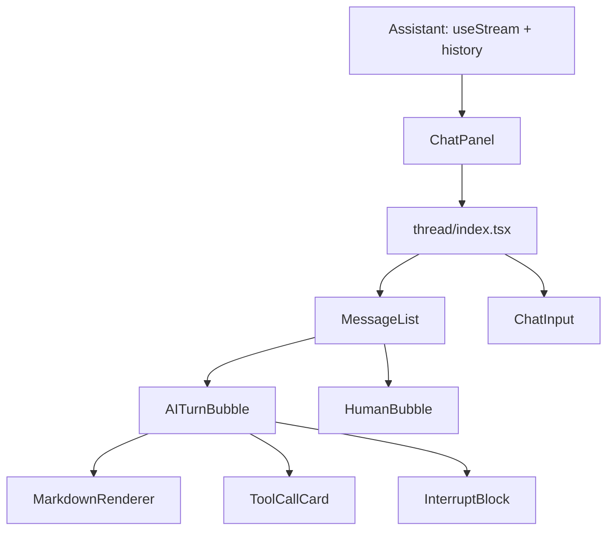

# RumiAI 前端架构

本文档描述当前前端实现。前端是 Next.js App Router 应用，所有业务组件均为 Client Components，核心页面是工作区三栏工作台和公开分享播放页。

## 1. 总览



前端同时访问两个后端服务：

| 服务 | 配置 | 用途 |
|------|------|------|
| FastAPI | `NEXT_PUBLIC_API_BASE`，默认 `http://localhost:8000` | 工作区、文档、任务、风格、音色、分享、文件预览下载 |
| LangGraph | `NEXT_PUBLIC_LANGGRAPH_API_URL` 或默认 `http://localhost:2024` | Agent 流式对话 |

重要原则：

- REST 调用集中在 `frontend/src/lib/api.ts`。
- Agent 通信集中在 `frontend/src/components/chat/assistant.tsx`。
- 前端不使用 `storage_path`、OSS key 或本地路径，文件访问统一通过 task/share/style/document 级 URL。
- 工作区状态以组件本地 `useState` + 轮询为主，不引入全局业务状态库。

## 2. 技术栈

| 类别 | 技术 |
|------|------|
| 框架 | Next.js 16 App Router |
| UI | React 19 Client Components |
| 样式 | Tailwind CSS 4 + CSS variables，暗色主题 |
| Agent 通信 | `@langchain/react` `useStream` |
| Markdown | `react-markdown` + `remark-gfm` + `react-syntax-highlighter` |
| 图标 | `lucide-react` |
| 包管理 | pnpm |

## 3. 目录结构

```text
frontend/src/
├── app/
│   ├── page.tsx                     # 首页：工作区列表
│   ├── admin/page.tsx               # 移动端友好的管理后台
│   ├── workspace/[id]/page.tsx      # 工作区主页面
│   └── share/[token]/page.tsx       # 公开分享播放页
├── components/
│   ├── admin/admin-utils.ts          # 管理会话与原生 SVG 趋势图辅助
│   ├── chat/
│   │   ├── assistant.tsx            # LangGraph useStream + 历史消息
│   │   ├── chat-panel.tsx           # 聊天面板容器
│   │   ├── clarify-form.tsx         # Agent interrupt 表单
│   │   ├── message-display.ts       # 消息内容归一化辅助
│   │   └── thread/                  # 消息线程拆分组件
│   ├── config/
│   │   ├── config-panel.tsx
│   │   ├── style-picker-dialog.tsx
│   │   ├── style-extraction-upload-dialog.tsx
│   │   ├── style-extraction-dialog.tsx
│   │   └── voice-picker-dialog.tsx
│   ├── document/document-panel.tsx
│   ├── layout/three-panel.tsx
│   ├── player/
│   │   ├── ppt-preview-dialog.tsx
│   │   └── ppt-player-dialog.tsx
│   ├── task/task-panel.tsx
│   ├── theme-provider.tsx
│   ├── theme-toggle.tsx
│   └── workspace/
│       ├── create-dialog.tsx
│       └── workspace-card.tsx
└── lib/
    ├── api.ts                       # REST API types + methods + URL builders
    └── user.ts                      # localStorage user_id
```

## 4. 路由

| 路由 | 文件 | 说明 |
|------|------|------|
| `/` | `app/page.tsx` | 工作区列表，新建、删除、进入工作区 |
| `/admin` | `app/admin/page.tsx` | 管理员登录、使用看板、用户明细、邀请码管理 |
| `/workspace/[id]` | `app/workspace/[id]/page.tsx` | 文档、聊天、配置、产出、预览、播放、风格提取 |
| `/share/[token]` | `app/share/[token]/page.tsx` | 公开访问 PPT 或口播稿播放页 |

### 首页

首页通过 `getUserId()` 从 localStorage 读取或生成用户 ID，然后调用 `listWorkspaces(userId)`。创建工作区后进入 `/workspace/[id]`，删除工作区会刷新列表。

### 管理后台

`/admin` 使用账号密码换取短期管理会话令牌，令牌只保存在 `sessionStorage`。后台包含看板、用户和邀请码三个页签；手机端使用底部导航和卡片列表，桌面端使用顶部导航。趋势图由原生 SVG 绘制，不引入额外图表库。管理 API 仍集中在 `lib/api.ts`。

### 工作区页面

工作区页面组合主要业务面板：



关键状态：

| 状态 | 来源 | 用途 |
|------|------|------|
| `workspace` | `getWorkspace()` | 用户 ID、名称、`ext_data` |
| `pptStyle` | `workspace.ext_data.ppt_style` | 注入 Agent state，传给配置面板 |
| `voiceId` | `workspace.ext_data.voice_info.id` | 注入 Agent state，传给配置面板 |
| `currentPptTaskId` | TaskPanel 生成口播稿动作 | `/narrate` 时指定 PPT task |
| `externalCommand` | TaskPanel 设置 | 向 ChatPanel 注入 slash command |
| `playerData` | TaskPanel 播放动作 | 打开 PPT + 音频同步播放器 |
| `previewTask` | TaskPanel 预览动作 | 打开 PPT HTML 预览/编辑 |
| `styleExtractionTaskId` | ConfigPanel/TaskPanel | 打开风格提取进度弹窗 |

桌面端使用 `ThreePanel` 三栏布局；移动端默认只展示聊天，中左右面板通过抽屉打开。

### 分享页

`/share/[token]` 调用 `getShareDetail(token)`。后端只返回安全 URL：

- PPT：`/api/shares/{token}/ppt`
- 口播音频：`/api/shares/{token}/audio/{slide_number}`

分享页有两种渲染模式：

| 类型 | 组件 | 行为 |
|------|------|------|
| `ppt` | `SharedPPTViewer` | iframe 直接加载 PPT HTML，支持全屏 |
| `narration` | `SharedNarrationPlayer` | fetch PPT HTML 后注入导航脚本，逐页同步播放 audio |

## 5. API 客户端

`frontend/src/lib/api.ts` 负责：

- 统一解析后端 envelope：`{data, code, message}`。
- 将业务错误转成 `ApiError`。
- 定义 Workspace、Document、Task、PptStyleInfo、VoiceInfo、ShareDetail 等类型。
- 生成预览、音频、分享 URL。
- 使用 fetch + Blob URL 触发跨域下载。
- 业务错误统一使用 `BusinessErrorPayload`；REST、Agent metadata 和后台任务错误均展示后端枚举提供的安全 message，不在前端解析 provider 原始异常。

常用方法分组：

| 分组 | 方法 |
|------|------|
| Workspace | `createWorkspace`, `listWorkspaces`, `getWorkspace`, `deleteWorkspace`, `updateWorkspaceThreadId`, `updateWorkspaceConfig` |
| Messages | `listThreadMessages`, `listThreadHistoryRuns`, `getMessageDetail` |
| Documents | `listDocuments`, `uploadDocument`, `deleteDocument` |
| Tasks | `listTasks`, `getTask`, `deleteTask`, `saveTaskFile`, `downloadTaskFile` |
| Share | `getTaskShare`, `createTaskShare`, `deleteTaskShare`, `getShareDetail` |
| Styles | `listPptStyles`, `deletePptStyle`, `submitStyleExtraction`, `saveStyleFromExtraction` |
| URL builders | `getTaskPreviewUrl`, `getTaskAudioUrl`, `getPptStylePreviewUrl`, `getStyleExtractionPreviewUrl` |

## 6. 聊天系统

聊天系统分三层：



`Assistant` 职责：

- 管理 LangGraph `threadId`，新 thread 自动保存到 workspace。
- 404 时清空 thread 并创建新会话。
- 初始化加载最近历史消息。
- 支持按 turn 或 run 分页加载更早消息。
- 将实时流消息与历史消息合并。
- 支持 `externalCommand`，例如 TaskPanel 注入 `/narrate`。

Thread 子组件职责：

| 文件 | 职责 |
|------|------|
| `message-display.ts` | 抽取可展示内容，处理不同消息结构 |
| `thread/message-list.tsx` | 消息列表和滚动 |
| `thread/ai-turn-bubble.tsx` | AI 回复、thinking、工具调用、引用 |
| `thread/human-bubble.tsx` | 用户消息 |
| `thread/tool-call-card.tsx` | 工具调用折叠卡片 |
| `thread/interrupt-block.tsx` | LangGraph interrupt 渲染 |
| `thread/chat-input.tsx` | 输入框、发送、停止、命令胶囊 |
| `thread/citations.ts` | ref marker / citation 处理 |

## 7. 文档面板

`DocumentPanel` 调用 `uploadDocument()` 上传文件，随后通过 `listDocuments()` 轮询解析状态。

状态来自后端：

```text
uploaded -> parsing -> parsed -> chunking -> indexing -> summarizing -> ready
                                      \-> error
```

`DocumentProgress` 包含 `stage_label`、`percent`、`message`、`current/total`、`estimated_minutes` 和 `estimate_note`，前端只负责展示，不推断后端实际进度。

## 8. 配置与风格

`ConfigPanel` 管理 PPT 风格、TTS 音色和风格提取入口。

| 组件 | 职责 |
|------|------|
| `style-picker-dialog.tsx` | 从 API 加载系统 + 自定义风格，按分类展示，支持删除自定义风格 |
| `voice-picker-dialog.tsx` | 展示内置音色，支持试听 |
| `style-extraction-upload-dialog.tsx` | 上传 PPTX，创建风格提取任务 |
| `style-extraction-dialog.tsx` | 轮询任务，展示步骤、预览、保存为自定义风格 |

工作区配置保存到后端 `workspace.ext_data`：

```json
{
  "ppt_style": "sys-swiss-modern",
  "voice_info": {"id": "Cherry", "name": "...", "trait": "...", "gender": "..."}
}
```

## 9. 任务与产出

`TaskPanel` 每 5 秒轮询 `listTasks(workspaceId)`。后端返回顶层任务，口播稿作为 PPT 的 `children` 嵌套展示。

任务类型：

| 类型 | 展示 | 常见动作 |
|------|------|----------|
| `ppt` | PPT HTML 产出 | 预览、编辑、下载、生成口播稿、分享、删除 |
| `narration` | 口播稿 + TTS 音频 | 播放、分享、删除 |
| `ppt_style_extraction` | 风格提取任务 | 查看进度/预览、保存风格、删除 |

`TaskPanel` 不解析内部文件路径，只根据 task id 调 API URL builder。

## 10. PPT 预览与播放

`PPTPreviewDialog`：

- 通过 `getTaskPreviewUrl(task.id)` 加载 PPT HTML。
- iframe `srcDoc` 预览。
- 编辑模式使用 `contentEditable`，保存时调用 `saveTaskFile()`。

`PPTPlayerDialog`：

- 读取 PPT HTML 和 narration slides。
- iframe 内通过 `postMessage` 切换 `.slide`。
- 每页音频用 `/api/tasks/{task_id}/audio/{slide_number}`。
- 支持播放/暂停、上一页/下一页、进度、音量和全屏。

## 11. 开发规则

- 新 REST 方法先加到 `lib/api.ts`，组件不要手写重复 fetch 封装。
- 新文件预览/下载能力优先新增 task/share/document/style 级 URL builder，不恢复 path-based API。
- 修改聊天渲染时，优先在 `components/chat/thread/` 内做局部改动，并运行已有 `.test.mjs`。
- 修改工作区配置时，同步考虑 `workspace/[id]/page.tsx`、`ConfigPanel` 和 Agent state 注入。
- 移动端和桌面端共用同一业务组件，布局差异留在 workspace page 和 `ThreePanel`。
