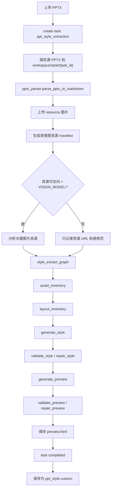

# PPT 风格提取架构

风格提取把用户上传的 `.pptx` 转成可复用的 PPT 风格模板。当前实现仍由 FastAPI 后台任务驱动，但风格模板生成与预览 HTML 生成已经封装为一个独立的 LangGraph pipeline；任务结果可以保存为 `ppt_style` 表中的用户自定义风格，后续被 `get_style_template` 工具用于 PPT 生成。

## 1. 总览

入口：

- 上传：`POST /api/workspaces/{workspace_id}/style-extraction`
- 查看任务：`GET /api/workspaces/{workspace_id}/tasks/{task_id}`
- 预览：`GET /api/tasks/{task_id}/style-preview`
- 保存：`POST /api/style-extraction/{task_id}/save`

核心实现：

| 文件 | 职责 |
|------|------|
| `backend/src/managers/style_extract_manager.py` | 风格提取工作流、任务进度、文件迁移、自定义风格保存 |
| `backend/src/agent/style_extract_graph.py` | 风格提取 LangGraph pipeline，负责资产盘点、布局盘点、风格模板生成/校验/修复、预览 HTML 生成/校验/修复 |
| `backend/src/parsers/pptx_parser.py` | 直接解析 PPTX ZIP/XML，输出 Markdown 结构报告和媒体文件 |
| `backend/src/managers/prompts/style_extract_prompt.md` | 根据 PPTX 结构报告生成风格模板 |
| `backend/src/managers/prompts/generate_cover_html_prompt.md` | 根据风格模板生成完整多页只读预览 HTML |
| `backend/src/api/routes.py` | API、预览代理、资源代理、thumbnail 处理 |
| `frontend/src/components/config/style-extraction-dialog.tsx` | 前端进度、预览、保存 |

## 2. 状态与数据

风格提取使用 `task` 表：

| 字段 | 值 |
|------|----|
| `type` | `ppt_style_extraction` |
| `status` | `generating`、`completed`、`failed`、`cancelled` |
| `title` | 创建时为 `风格提取: {filename}`，完成后改成风格名 |
| `result_data` | 进度、风格描述、预览路径、资源 manifest 等 JSON |

进度流：

```text
uploaded -> parsing -> analyzing_style -> generating_preview -> completed
                                      \-> failed/cancelled
```

`result_data` 主要字段：

| 字段 | 说明 |
|------|------|
| `progress_step` | 当前步骤，前端用来展示进度 |
| `pptx_filename` | 原始 PPTX 文件名 |
| `pptx_storage_key` | 源 PPTX 在 FileStore 的 key，仅后端使用 |
| `style_name` | 中文风格名 |
| `style_name_en` | kebab-case 英文名 |
| `description` | 短描述，展示给用户 |
| `style_description` | 完整风格模板，保存到 `ppt_style.style_description` |
| `preview_html_path` | 预览 HTML 文件路径/key，仅后端使用 |
| `resource_prefix` | 风格任务资源目录，仅后端使用 |
| `resource_manifest` | 图片资源清单，保存风格时会迁移并改写 URL |
| `saved_style_id` | 已保存为自定义风格后的 style id，防重复保存 |
| `error` | 失败原因 |

API 返回任务时会 sanitize，不把内部路径字段暴露给前端。

## 3. 工作流



## 4. PPTX 解析

`pptx_parser.py` 不依赖 PowerPoint，也不启动浏览器。它把 PPTX 当作 ZIP 读取并解析 XML：

- `ppt/presentation.xml`：页面尺寸。
- `ppt/theme/theme1.xml`：主题配色和字体。
- `ppt/slides/slide*.xml`：背景、形状、文本、图片引用。
- `ppt/slides/_rels/*.rels`：图片关系映射。
- `ppt/media/*`：抽取媒体文件到临时 `resource/` 目录。

输出 Markdown 结构报告，包含：

- 全局页面尺寸、幻灯片数量。
- 主题配色表和字体。
- 每页背景类型：图片、纯色、渐变、主题引用。
- 每页形状表：kind、位置、尺寸、填充、文本、文字颜色。
- 字段说明附录。

如果提供 `resource_base_url`，解析器会把 `../media/image.png` 替换成 `{resource_base_url}/resource/image.png`。本地模式下 `resource_base_url` 为空，后续通过 API 代理 URL 补足。

## 5. 图片资源与视觉分析

资源存储目录：

```text
user/{user_id}/workspace/{workspace_id}/style/{task_id}/
├── source.pptx
├── preview.html
└── resource/
    └── image*.png
```

`StyleExtractManager` 当前只从 Markdown 中识别背景图片作为风格资产：

```text
## 第 1 页
### 背景
背景图片： `../media/image1.png`

```

然后构造 `resource_manifest`：

```json
[
  {
    "filename": "image1.png",
    "url": "/api/tasks/{task_id}/style-resource/image1.png",
    "used_in_slides": [1],
      "usage_type": "background",
      "usage_types": ["background"],
      "description": {
      "style": "...",
      "visual_theme": "...",
      "color_tone": "...",
      "composition": "...",
      "safe_zones": "...",
      "usage_notes": "..."
    }
  }
]
```

普通图片、图标、装饰图形暂不进入 `resource_manifest`，也不会调用视觉模型；它们只保留在 PPTX 解析报告中作为结构参考。

视觉分析只在同时满足以下条件时执行：

- 当前 provider 可提供可访问 URL。
- 配置了 `VISION_MODEL`。
- 图片 URL 是 `http://` 或 `https://`。

视觉分析只针对背景图执行。视觉分析失败不会让任务失败，manifest 仍保留背景图资源 URL。

## 6. LLM 生成

风格提取使用文本模型 `SUMMARIZATION_MODEL`，通过 `backend/src/agent/style_extract_graph.py` 运行独立 LangGraph pipeline：

1. `asset_inventory` 节点把 `resource_manifest` 汇总成模型可读的视觉资产盘点。
2. `layout_inventory` 节点从 Markdown 生成页面类型和布局线索盘点。
3. `generate_style` 节点调用 `build_style_description_prompt(enriched_markdown)`，生成带 YAML frontmatter 的 Markdown 风格模板。
4. `validate_style` 节点校验 frontmatter、`page_layouts`、固定页面类型中文展示名、`section_policy` 等结构要求；失败时 `repair_style` 最多修复一次。
5. `generate_preview` 节点调用 `build_preview_html_prompt(style_description, resource_base_url, resource_manifest)`，生成完整多页只读预览 HTML。
6. `validate_preview` 节点校验 `<!DOCTYPE html>`、只读标记、`.slide`、启用页面类型覆盖、`data-page-type`、入场动画等；失败时 `repair_preview` 最多修复一次。

校验结果用于驱动修复和记录 warning；`StyleExtractManager` 不再用最终校验结果阻断任务保存。模型输出问题优先通过 prompt 约束优化，而不是在代码中硬编码补齐风格模板。

FastAPI 后台任务仍负责 PPTX 保存、PPTX 解析、图片资源上传、进度更新、preview.html 保存和自定义风格迁移。当前 graph 暂不暴露为 `langgraph.json` 中的服务图。

后续优化可以继续增强节点质量，例如把 `asset_inventory` 和 `layout_inventory` 改为模型参与的结构化输出，或增加更细的业务词污染检测、资源 URL 可达性检查和视觉截图检查。

风格模板期望格式：

```markdown
---
name: 蓝色商务卡片风
name_en: blue-business-card
description: 深蓝商务风格，卡片式布局...
---

# 蓝色商务卡片风
...
```

`_parse_frontmatter()` 会解析 `name`、`name_en`、`description`，正文作为 `style_description`。`name_en` 会被清洗成 kebab-case；如果不可用，会按中文名哈希生成 fallback。

预览 HTML 会去掉 LLM 可能输出的 Markdown code fence，并在通过 graph 校验后保存为 `preview.html`。

## 7. 预览与资源代理

风格提取任务预览：

```text
GET /api/tasks/{task_id}/style-preview
GET /api/tasks/{task_id}/style-resource/{filename}
```

已保存自定义风格预览：

```text
GET /api/ppt-styles/{style_id}/preview
GET /api/ppt-styles/{style_id}/resource/{filename}
```

预览 HTML 会做资源 URL 替换，避免直接暴露 OSS key 或本地路径。

`thumb=1` 时后端会对 HTML 做缩略图优化：

- 去掉外部字体 link。
- 去掉 viewport 相关 media query。
- 把 `vw/vh/dvh` 转成 1920x1080 基准 px。
- 注入固定 `.slide` 尺寸和 transform scale 脚本。

## 8. 保存为自定义风格

`save_as_custom_style(task_id, user_id)` 执行：

1. 校验任务存在且 `status=completed`。
2. 检查 `saved_style_id`，防止重复保存。
3. 在 `ppt_style` 表创建 `category=custom` 记录。
4. 把源 PPTX、resource 图片、preview HTML 从 workspace task 目录迁移到：

```text
user/{user_id}/style/{style_id}/
```

5. 把 `resource_manifest.url` 从任务资源 URL 改成永久风格资源 URL。
6. 同步改写 `style_description` 和 preview HTML 中的旧 URL。
7. 写回 `ppt_style.resource_manifest` 和可能更新后的 `style_description`。
8. 在 task `result_data.saved_style_id` 标记已保存。

保存后的风格会出现在 `/api/ppt-styles?user_id=...`，前端可选择为当前工作区 PPT 风格。

## 9. 与 PPT 生成的关系

PPT 生成时主 Agent 使用 `get_style_template` 工具读取当前工作区配置的 `ppt_style`：

- 系统风格：读取 seed 到 DB 的 `ppt_style`。
- 自定义风格：读取用户保存的 `style_description` 和 `resource_manifest`。

因此风格提取不是直接生成 PPT，而是生成一个可复用的 style template。后续 `ppt` skill 会基于该 template 生成 HTML PPT。

## 10. 前端交互

前端入口在 `ConfigPanel`：

1. 用户点击风格提取入口。
2. `StyleExtractionUploadDialog` 上传 `.pptx`。
3. 后端返回 task id。
4. `StyleExtractionDialog` 每 2 秒轮询 `getTask()`。
5. 根据 `progress_step` 展示步骤。
6. 完成后 iframe 加载 `getStyleExtractionPreviewUrl(taskId)`。
7. 用户点击“保存为新的风格模板”，调用 `saveStyleFromExtraction()`。
8. 保存成功后刷新 `listPptStyles()`。

`TaskPanel` 也会展示 `ppt_style_extraction` 任务，可从产出列表重新打开进度/预览弹窗。

## 11. 开发注意

- 风格提取是 FastAPI 后台任务，LLM 生成阶段使用独立 `style_extract_graph`；不要把它接入主对话 Agent graph，除非明确要变成 Agent 工具。
- 新增 result_data 字段时同步检查 `_sanitize_result_data()`，避免泄漏存储路径。
- 本地模式和 OSS 模式都要通过 API 代理访问预览资源，不要把 provider URL 持久化给前端。
- 保存自定义风格时必须迁移资源并改写 URL，否则后续删除 workspace task 会导致风格资源失效。
- 取消任务只对当前进程内 `_active_tasks` 有效；服务重启后无法中断已丢失的后台协程引用。
