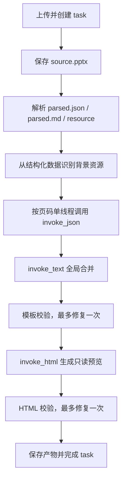

# PPT 风格提取架构

PPT 风格提取由 FastAPI 后台任务执行，不经过主对话 Agent graph。链路把用户上传的 PPTX 解析为结构化数据，按页调用文本模型理解视觉风格，合并为可复用 Markdown 模板，再生成只读多页预览 HTML。

## 1. 入口与模块

- 上传：`POST /api/workspaces/{workspace_id}/style-extraction`
- 任务：`GET /api/workspaces/{workspace_id}/tasks/{task_id}`
- 预览：`GET /api/tasks/{task_id}/style-preview`
- 保存：`POST /api/style-extraction/{task_id}/save`

| 文件 | 职责 |
|------|------|
| `backend/src/managers/style_extract_manager.py` | 文件、任务进度、顺序编排、降级、校验修复、自定义风格保存 |
| `backend/src/managers/style_llm_runner.py` | 无 tools/skills/middleware 的轻量 LLM 调用和输出规整 |
| `backend/src/managers/style_extract_utils.py` | frontmatter、名称、模板与 HTML 纯函数校验 |
| `backend/src/parsers/pptx_parser.py` | PPTX ZIP/XML 解析，输出结构化 JSON、Markdown 和媒体 |
| `backend/src/managers/prompts/style_slide_understanding_prompt.md` | 单页视觉理解 JSON |
| `backend/src/managers/prompts/style_merge_template_prompt.md` | 逐页结果全局合并 |
| `backend/src/managers/prompts/style_preview_html_prompt.md` | 简约只读 HTML-PPT 预览 |

旧 `backend/src/agent/style_extract_graph.py`、`style_extract_prompt.md` 和 `generate_cover_html_prompt.md` 已下线。风格提取不在 `langgraph.json` 注册 graph。

## 2. 状态与产物

任务类型为 `ppt_style_extraction`，状态流：

```text
generating(parsing -> analyzing_style -> generating_preview) -> completed
                                                             -> failed/cancelled
```

运行期工作目录：

```text
{DATA_DIR}/workspace_work/{workspace_id}/style_extract/{task_id}/
├── source/source.pptx
├── pptx_unpack/ppt/...
├── resource/image*
├── parsed.json
├── parsed.md
├── slide_understandings.json
├── style_template.md
└── preview.html
```

FileStore 目录：

```text
user/{user_id}/workspace/{workspace_id}/style/{task_id}/
├── source.pptx
├── preview.html
└── resource/image*
```

`task.result_data` 只保存进度、最终风格字段、背景资源清单、少量 warning 和中间文件指针。API 返回任务时仍会过滤内部路径。

## 3. 执行链路



逐页理解使用普通 `for` 循环逐次 `await`，禁止 `asyncio.gather`。每页完成后立即覆写 `slide_understandings.json` 并更新 `current_slide/total_slides`。单页调用失败会生成结构化 fallback 并继续；全局模板或预览修复后仍不合格才让任务失败。

## 4. PPTX 解析与背景资源

解析器直接读取 PPTX ZIP/XML，提取页面尺寸、主题色、字体、每页背景、形状、文本摘要、图片引用和媒体文件。它保留 `parse_pptx_to_markdown()` 兼容入口，同时提供 `parse_pptx_to_structured()` 和 `write_parse_outputs()`。

首版 `resource_manifest` 只包含背景图片：

- 显式 slide background 图片。
- 覆盖至少 90% 画布且贴近左上角的全页图片。
- 授权、版权、来源、素材或下载说明页的图片排除。
- 普通内容图、Logo、图标、纹理和装饰图不进入 manifest。

背景视觉分析仅在配置 `VISION_MODEL` 且 provider 能提供 HTTP(S) URL 时执行；失败只留下空描述，不中断任务。

## 5. LLM 调用

`StyleLLMRunner` 使用 `SUMMARIZATION_MODEL`、`SUMMARIZATION_API_KEY`、`SUMMARIZATION_API_BASE` 初始化 `ChatOpenAI`，直接调用 `ainvoke(SystemMessage + HumanMessage)`。

| 阶段 | 方法 | 输出 |
|------|------|------|
| 单页理解 | `invoke_json()` | 单页视觉理解 dict |
| 模板合并/修复 | `invoke_text()` | 带 frontmatter 的 Markdown |
| 预览生成/修复 | `invoke_html()` | 纯 HTML |

Runner 不访问数据库或文件，不更新 task，不做隐式重试。它只清理 code fence、提取 JSON object、记录 purpose/长度/耗时并统一异常。

单页输入包括 deck context、当前页结构、背景 manifest 和上一页类型提示。全局合并排除 `page_type=exclude` 的页面，并生成固定 `cover/agenda/section/content/closing` 能力图。Markdown 正文允许 fenced code block。

## 6. 预览与校验

预览 prompt 是 PPT skill 的简化规则集，不包含用户提问、二次确认、大纲规划、素材规划或 `save_ppt`。它会内联必要 viewport CSS，要求：

- `body[data-preview-mode="readonly"]`
- 每页 `section.slide` 同时有 `data-page-type` 和 `data-layout`
- 覆盖所有 `enabled: true` 页面类型
- 禁止 `contenteditable`、`localStorage`、`InlineEditor`
- 背景图片只能来自 `resource_manifest`
- 支持键盘、滚轮、触摸和导航点翻页
- 动画为可选能力，不校验或强制 CSS 类名协议

模板和 HTML 都先校验，失败后最多调用一次 repair。repair 仍失败会记录清晰错误并把 task 标记为 `failed`。

## 7. 保存为自定义风格

`save_as_custom_style()` 保持原有 API 和数据兼容：

1. 创建 `category=custom` 的 `ppt_style`。
2. 将 source、resource 和 preview 迁移到 `user/{user_id}/style/{style_id}`。
3. 将 manifest、模板和 HTML 中的任务资源 URL 改写为永久风格资源代理 URL。
4. 写回 `resource_manifest`、`style_description` 和 `saved_style_id`。

后续 PPT 生成仍通过 `get_style_template` 读取保存后的模板和资源。

删除风格提取任务时，API 会同时删除 FileStore 中的任务文件和 `{DATA_DIR}/workspace_work/{workspace_id}/style_extract/{task_id}` 临时目录。

## 8. 排查与后续优化

排查顺序：先看 task 的 `progress_step/error/warnings`，再看工作目录中的 `parsed.json`、`slide_understandings.json`、`style_template.md` 和 `preview.html`。日志只记录调用目的和长度，不记录完整 prompt。

失败时 `result_data.error` 使用统一 `BusinessError` 结构。额度、认证、限流、超时和连接错误会立即终止逐页执行并保留断点，不再继续生成批量 fallback；原始模型响应只进入后端日志。

后续优化记录在 `TODO.md`：单页加入真实 slide PNG、逐页调用支持可配置并发，以及 manifest 扩展普通图片、Logo、图标、纹理和装饰资源。
